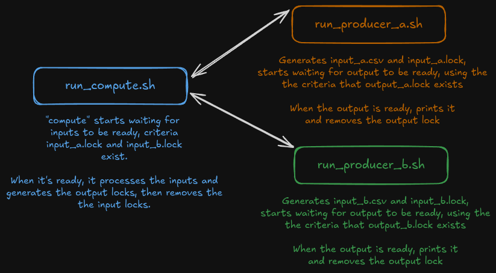

# multiple_producer_consumer

Basic producer-consumer pattern across multiple streams, based on code provided by Chancellor Pascale in the CUDA at Scale for the Enterprise course at Johns Hopkins University.

## Project workflow

## Running the code

1. Open three terminal windows.
2. In the first terminal window, run `run_compute.sh`.
3. In the second terminal window, run `run_producer_a.sh`.
4. In the third terminal window, execute `run_producer_b.sh`.
5. When all three have finished, run `clean.sh`.